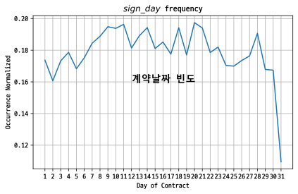
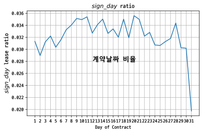
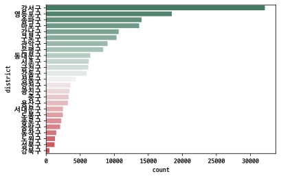

# EDA, Regression Modeling and More with Seoul Officetel Rentals Data (2011-2021)

## Introduction

## Preprocessing

### Set Hangeul Font, 한글 폰트 설정 

- For plotting purposes

- matplotlib.`rc("font",family=font_name)`


```python
import matplotlib as mpl
import matplotlib.font_manager as fm 

# Nanum Gothic Coding
# font_path= r"C:\tmp\NanumGothicCoding-Bold.ttf"

# D2Coding
font_path= r"C:\tmp\D2CodingBold-Ver1.3.2-20180524.ttf".replace("\\","/")

font_name= fm.FontProperties(fname=font_path).get_name() # D2Coding

mpl.rc("font",family=font_name)
```


```python
import pandas as pd 

path= "./data/"
#csv_2021= "seoul_rental_2021.csv"
csv_2020= "seoul_rental_2020.csv"
csv_2019= "seoul_rental_2019.csv"
csv_2018= "seoul_rental_2018.csv"
csv_2017= "seoul_rental_2017.csv"
csv_2016= "seoul_rental_2016.txt"
csv_2015= "seoul_rental_2015.txt"
csv_2014= "seoul_rental_2014.txt"
csv_2014_clean= "seoul_rental_2014_clean.txt"
csv_2013= "seoul_rental_2013.txt"
csv_2012= "seoul_rental_2012.txt"
csv_2011= "seoul_rental_2011.txt"

# df_2021= pd.read_csv(path+csv_2021,encoding="cp949")
# df_2021.shape
df_2020= pd.read_csv(path+csv_2020,encoding="cp949")
df_2019= pd.read_csv(path+csv_2019,encoding="cp949")
df_2018= pd.read_csv(path+csv_2018,encoding="cp949")
df_2017= pd.read_csv(path+csv_2017,encoding="cp949")
df_2016= pd.read_csv(path+csv_2016,encoding="utf-8")
df_2015= pd.read_csv(path+csv_2015,encoding="utf-8")
df_2014= pd.read_csv(path+csv_2014,encoding="utf-8")
df_2013= pd.read_csv(path+csv_2013,encoding="utf-8")
df_2012= pd.read_csv(path+csv_2012,encoding="utf-8")
df_2011= pd.read_csv(path+csv_2011,encoding="utf-8")
```

### Merge 10-year records into one dataframe


- Check the shape of all the dataframes


```python
df_list= [df_2020,df_2019,df_2018,df_2017,df_2016,df_2015,df_2014,df_2013,df_2012,df_2011]
for i,df in enumerate(df_list):
    year=2020-i
    print(year,":",df.shape)
```

    2020 : (49971, 14)
    2019 : (48289, 14)
    2018 : (40030, 14)
    2017 : (34674, 14)
    2016 : (27592, 14)
    2015 : (24205, 14)
    2014 : (20820, 16)
    2013 : (16209, 14)
    2012 : (12529, 14)
    2011 : (10466, 14)
    

- The two unnamed columns are from the year 2014.
- tabulation of 1909 rows incorrect; has to be manually adjusted


```python
df_2014.isna().sum()
```


    시군구                0
    번지                16
    본번                 0
    부번                 0
    단지명             1909
    전월세구분              0
    전용면적(㎡)         1909
    계약년월               0
    계약일                0
    보증금(만원)            0
    월세(만원)             0
    층                  0
    건축년도               1
    도로명                0
    Unnamed: 14    18911
    Unnamed: 15    18911
    dtype: int64


```python
df_2014_clean= pd.read_csv(path+csv_2014_clean,encoding="utf-8")
df_2014_clean.shape
```


    (20820, 14)


```python
df_list= [df_2020,df_2019,df_2018,df_2017,df_2016,df_2015,df_2014_clean,df_2013,df_2012,df_2011]
df_backup= pd.concat(df_list,ignore_index=True)
df= df_backup.copy()
df.info()
```

    <class 'pandas.core.frame.DataFrame'>
    RangeIndex: 284785 entries, 0 to 284784
    Data columns (total 14 columns):
     #   Column   Non-Null Count   Dtype  
    ---  ------   --------------   -----  
     0   시군구      284785 non-null  object 
     1   번지       283949 non-null  object 
     2   본번       284785 non-null  int64  
     3   부번       284785 non-null  int64  
     4   단지명      284785 non-null  object 
     5   전월세구분    284785 non-null  object 
     6   전용면적(㎡)  284785 non-null  float64
     7   계약년월     284785 non-null  int64  
     8   계약일      284785 non-null  int64  
     9   보증금(만원)  284785 non-null  object 
     10  월세(만원)   284785 non-null  int64  
     11  층        284785 non-null  int64  
     12  건축년도     276309 non-null  float64
     13  도로명      284770 non-null  object 
    dtypes: float64(2), int64(6), object(6)
    memory usage: 30.4+ MB
    


```python
df.head(1)
```


<div>
<style scoped>
    .dataframe tbody tr th:only-of-type {
        vertical-align: middle;
    }

    .dataframe tbody tr th {
        vertical-align: top;
    }

    .dataframe thead th {
        text-align: right;
    }
</style>
<table border="1" class="dataframe">
  <thead>
    <tr style="text-align: right;">
      <th></th>
      <th>시군구</th>
      <th>번지</th>
      <th>본번</th>
      <th>부번</th>
      <th>단지명</th>
      <th>전월세구분</th>
      <th>전용면적(㎡)</th>
      <th>계약년월</th>
      <th>계약일</th>
      <th>보증금(만원)</th>
      <th>월세(만원)</th>
      <th>층</th>
      <th>건축년도</th>
      <th>도로명</th>
    </tr>
  </thead>
  <tbody>
    <tr>
      <th>0</th>
      <td>서울특별시 강남구 개포동</td>
      <td>1237-3</td>
      <td>1237</td>
      <td>3</td>
      <td>(1237-3)</td>
      <td>월세</td>
      <td>29.51</td>
      <td>202004</td>
      <td>11</td>
      <td>500</td>
      <td>100</td>
      <td>2</td>
      <td>2020.0</td>
      <td>논현로20길 12</td>
    </tr>
  </tbody>
</table>
</div>


### Columns to be merged/dropped

- 번지 (lot number)
- 본번 (primary lot number)
- 부번 (secondary lot number)
- 단지명 (building/estate name)
- 도로명 (street address)

The street address is the only address that is legally valid in South Korea since the Road Name Address Act came fully into effect on January 1, 2014. The estate name has additional information and will be merged with the street name. The empty cells of the street address column will be filled the lot number and/or the estate name. The lot number is made up of a primary number hyphenated with a secondary number, e.g., 1237-3.

🇰🇷 
> 도로명주소법이 전면적으로 시행되면서 2014년 1월 1일부터는 토지대장을 제외한 모든 곳에 도로명주소만을 쓸 수 있다. 따라서 도로명 주소와 단지명을 합쳐 각 건물의 전체 주소를 표시하되 도로명 주소 또는 단지명 컬럼이 비어 있으면 번지를 사용한다.

### Rename data columns

- 시군구 → district1
- 번지 → lot_num
- 본번 → lot_num_primary
- 부번 → lot_num_secondary
-	단지명 → estate_name
-	전월세구분 → rent_type (lump-sum or monthly)
-	전용면적(㎡) → unit_size (m²)
-	계약년월 → sign_yrmon
-	계약일 → sign_day
-	보증금(만원) → deposit (in 10,000 won)
-	월세(만원) → rent_price (in 10,000 won)
-	층 → floor
-	건축년도 → yr_built
-	도로명 → str_addr


```python
cols= ["district1","lot_num","lot_num_primary","lot_num_secondary","estate_name","rent_type","unit_size","sign_yymm","sign_dd","deposit","rent_price","floor","yr_built","str_addr"]

df.columns= cols
df.head(1)
```


<div>
<style scoped>
    .dataframe tbody tr th:only-of-type {
        vertical-align: middle;
    }

    .dataframe tbody tr th {
        vertical-align: top;
    }

    .dataframe thead th {
        text-align: right;
    }
</style>
<table border="1" class="dataframe">
  <thead>
    <tr style="text-align: right;">
      <th></th>
      <th>district1</th>
      <th>lot_num</th>
      <th>lot_num_primary</th>
      <th>lot_num_secondary</th>
      <th>estate_name</th>
      <th>rent_type</th>
      <th>unit_size</th>
      <th>sign_yymm</th>
      <th>sign_dd</th>
      <th>deposit</th>
      <th>rent_price</th>
      <th>floor</th>
      <th>yr_built</th>
      <th>str_addr</th>
    </tr>
  </thead>
  <tbody>
    <tr>
      <th>0</th>
      <td>서울특별시 강남구 개포동</td>
      <td>1237-3</td>
      <td>1237</td>
      <td>3</td>
      <td>(1237-3)</td>
      <td>월세</td>
      <td>29.51</td>
      <td>202004</td>
      <td>11</td>
      <td>500</td>
      <td>100</td>
      <td>2</td>
      <td>2020.0</td>
      <td>논현로20길 12</td>
    </tr>
  </tbody>
</table>
</div>


```python
df.isna().sum()
```


    district1               0
    lot_num               836
    lot_num_primary         0
    lot_num_secondary       0
    estate_name             0
    rent_type               0
    unit_size               0
    sign_yymm               0
    sign_dd                 0
    deposit                 0
    rent_price              0
    floor                   0
    yr_built             8476
    str_addr               15
    dtype: int64


```python
import numpy as np 
nan_index= np.where(df.str_addr.isna())
nan_index
```


    (array([238349, 238350, 238351, 238352, 238353, 238354, 238355, 238356,
            238357, 238358, 238359, 238360, 238361, 238362, 238363],
           dtype=int64),)


```python
nan_index[0]#.flatten()
```


    array([238349, 238350, 238351, 238352, 238353, 238354, 238355, 238356,
           238357, 238358, 238359, 238360, 238361, 238362, 238363],
          dtype=int64)


### Merge `str_addr` and `estate_name`
- into new column `street_addr`, and

- drop the two columns


```python
del df["street_addr"]
```


```python
import numpy as np
df["estate_name"]= df["estate_name"].astype(str)
df["str_addr"]= df.str_addr.astype(str)
str_addr_series= [row["str_addr"].replace("nan","")+row["estate_name"] if row["str_addr"]=="nan" else row["str_addr"]+", "+row["estate_name"] for i,row in df.iterrows()]
df.insert(0,"street_addr",str_addr_series)
#df["str_addr"].replace(np.NaN,"",regex=True) + ", "+ df["estate_name"]
#df
```


```python
df.isna().sum()
```


    district1               0
    lot_num               836
    lot_num_primary         0
    lot_num_secondary       0
    estate_name             0
    rent_type               0
    unit_size               0
    sign_yymm               0
    sign_dd                 0
    deposit                 0
    rent_price              0
    floor                   0
    yr_built             8476
    str_addr                0
    street_addr             0
    dtype: int64


```python
# df.iloc[nan_index[0]]
```

### Drop unused columns

- lot_num
- lot_num_primary
- lot_num_secondary
- estate_name
- str_addr


```python
df.drop(["lot_num","lot_num_primary","lot_num_secondary","estate_name","str_addr"],axis=1,inplace=True)
df.head(1)
```


<div>
<style scoped>
    .dataframe tbody tr th:only-of-type {
        vertical-align: middle;
    }

    .dataframe tbody tr th {
        vertical-align: top;
    }

    .dataframe thead th {
        text-align: right;
    }
</style>
<table border="1" class="dataframe">
  <thead>
    <tr style="text-align: right;">
      <th></th>
      <th>street_addr</th>
      <th>district1</th>
      <th>rent_type</th>
      <th>unit_size</th>
      <th>sign_yymm</th>
      <th>sign_dd</th>
      <th>deposit</th>
      <th>rent_price</th>
      <th>floor</th>
      <th>yr_built</th>
    </tr>
  </thead>
  <tbody>
    <tr>
      <th>0</th>
      <td>논현로20길 12, (1237-3)</td>
      <td>서울특별시 강남구 개포동</td>
      <td>월세</td>
      <td>29.51</td>
      <td>202004</td>
      <td>11</td>
      <td>500</td>
      <td>100</td>
      <td>2</td>
      <td>2020.0</td>
    </tr>
  </tbody>
</table>
</div>


### New column `district`

- 전체 데이터가 서울 지역에 한정되어 있으므로 "서울특별시", 동 이름 제거


```python
df.insert(0,"district",[val.split()[1] for i,val in df.district1.iteritems() ])
df.head(2)
```


<div>
<style scoped>
    .dataframe tbody tr th:only-of-type {
        vertical-align: middle;
    }

    .dataframe tbody tr th {
        vertical-align: top;
    }

    .dataframe thead th {
        text-align: right;
    }
</style>
<table border="1" class="dataframe">
  <thead>
    <tr style="text-align: right;">
      <th></th>
      <th>district</th>
      <th>street_addr</th>
      <th>district1</th>
      <th>rent_type</th>
      <th>unit_size</th>
      <th>sign_yymm</th>
      <th>sign_dd</th>
      <th>deposit</th>
      <th>rent_price</th>
      <th>floor</th>
      <th>yr_built</th>
    </tr>
  </thead>
  <tbody>
    <tr>
      <th>0</th>
      <td>강남구</td>
      <td>논현로20길 12, (1237-3)</td>
      <td>서울특별시 강남구 개포동</td>
      <td>월세</td>
      <td>29.51</td>
      <td>202004</td>
      <td>11</td>
      <td>500</td>
      <td>100</td>
      <td>2</td>
      <td>2020.0</td>
    </tr>
    <tr>
      <th>1</th>
      <td>강남구</td>
      <td>논현로20길 12, (1237-3)</td>
      <td>서울특별시 강남구 개포동</td>
      <td>월세</td>
      <td>29.95</td>
      <td>202005</td>
      <td>30</td>
      <td>3000</td>
      <td>80</td>
      <td>4</td>
      <td>2020.0</td>
    </tr>
  </tbody>
</table>
</div>


```python
df.insert(2,"district_sub",[f"{val.split()[2]}" for i,val in df.district1.iteritems()])
df.head(1)
```


<div>
<style scoped>
    .dataframe tbody tr th:only-of-type {
        vertical-align: middle;
    }

    .dataframe tbody tr th {
        vertical-align: top;
    }

    .dataframe thead th {
        text-align: right;
    }
</style>
<table border="1" class="dataframe">
  <thead>
    <tr style="text-align: right;">
      <th></th>
      <th>district</th>
      <th>street_addr</th>
      <th>district_sub</th>
      <th>district1</th>
      <th>rent_type</th>
      <th>unit_size</th>
      <th>sign_yymm</th>
      <th>sign_dd</th>
      <th>deposit</th>
      <th>rent_price</th>
      <th>floor</th>
      <th>yr_built</th>
    </tr>
  </thead>
  <tbody>
    <tr>
      <th>0</th>
      <td>강남구</td>
      <td>논현로20길 12, (1237-3)</td>
      <td>개포동</td>
      <td>서울특별시 강남구 개포동</td>
      <td>월세</td>
      <td>29.51</td>
      <td>202004</td>
      <td>11</td>
      <td>500</td>
      <td>100</td>
      <td>2</td>
      <td>2020.0</td>
    </tr>
  </tbody>
</table>
</div>


### Drop columns

- `district1`


```python
# drop "district1" column
df.drop("district1",axis=1,inplace=True)
df.head(1)
```


<div>
<style scoped>
    .dataframe tbody tr th:only-of-type {
        vertical-align: middle;
    }

    .dataframe tbody tr th {
        vertical-align: top;
    }

    .dataframe thead th {
        text-align: right;
    }
</style>
<table border="1" class="dataframe">
  <thead>
    <tr style="text-align: right;">
      <th></th>
      <th>district</th>
      <th>street_addr</th>
      <th>district_sub</th>
      <th>rent_type</th>
      <th>unit_size</th>
      <th>sign_yymm</th>
      <th>sign_dd</th>
      <th>deposit</th>
      <th>rent_price</th>
      <th>floor</th>
      <th>yr_built</th>
    </tr>
  </thead>
  <tbody>
    <tr>
      <th>0</th>
      <td>강남구</td>
      <td>논현로20길 12, (1237-3)</td>
      <td>개포동</td>
      <td>월세</td>
      <td>29.51</td>
      <td>202004</td>
      <td>11</td>
      <td>500</td>
      <td>100</td>
      <td>2</td>
      <td>2020.0</td>
    </tr>
  </tbody>
</table>
</div>


### Data imputation: `yr_built`

- 🇰🇷 건축년도가 비어 있는 경우 0으로 채움
- 🇺🇸 Impute empty cells of `yr_built` with zero.


```python
df.yr_built.isnull().sum()
```


    8456


```python
df.yr_built.fillna(0,inplace=True)
df.yr_built.isnull().sum()
```


    0


### Change `yr_built` data type

- From _float_ to _int_


```python
df.yr_built= df.yr_built.astype("int")
df.head(1)
```


<div>
<style scoped>
    .dataframe tbody tr th:only-of-type {
        vertical-align: middle;
    }

    .dataframe tbody tr th {
        vertical-align: top;
    }

    .dataframe thead th {
        text-align: right;
    }
</style>
<table border="1" class="dataframe">
  <thead>
    <tr style="text-align: right;">
      <th></th>
      <th>district</th>
      <th>street_addr</th>
      <th>estate_name</th>
      <th>rent_type</th>
      <th>unit_size</th>
      <th>sign_yrmon</th>
      <th>sign_day</th>
      <th>deposit</th>
      <th>rent_price</th>
      <th>floor</th>
      <th>yr_built</th>
    </tr>
  </thead>
  <tbody>
    <tr>
      <th>0</th>
      <td>강남구</td>
      <td>논현로20길 12 (개포동)</td>
      <td>(1237-3)</td>
      <td>월세</td>
      <td>29.51</td>
      <td>202004</td>
      <td>11</td>
      <td>500</td>
      <td>100</td>
      <td>2</td>
      <td>2020</td>
    </tr>
  </tbody>
</table>
</div>


```python
df.yr_built.value_counts()[:10]
```


    2017    20905
    2018    16010
    2004    15272
    2016    14448
    2015    12541
    2019    12399
    2014    11959
    2013    11745
    2003    10551
    2005     8665
    Name: yr_built, dtype: int64


### Create new column `sign_date`

- 계약년월 (_year and month of contract_)
- 계약일 (_day of contract_)

🇰🇷 
> 계약년월(예: 202004)과 계약일(11)을 합쳐 sign_date (예: 2020-04-11) 생성


```python
df.columns
```


    Index(['district', 'street_addr', 'estate_name', 'rent_type', 'unit_size',
           'sign_yrmon', 'sign_day', 'deposit', 'rent_price', 'floor', 'yr_built'],
          dtype='object')


```python
df.sign_day.value_counts()[:10]
```


    20    6157
    11    6124
    9     6077
    14    6059
    18    6057
    21    6052
    10    6045
    28    5946
    13    5900
    8     5889
    Name: sign_day, dtype: int64


```python
from sklearn.preprocessing import Normalizer

transformer= Normalizer()

sign_day_counts= df.sign_day.value_counts(sort=False)
sign_day_scaled= transformer.fit_transform([sign_day_counts])

print(sign_day_scaled.shape)
sign_day_scaled[0][:5]
```

    (1, 31)
    


    array([0.17370481, 0.16065611, 0.17325596, 0.17864216, 0.16828655])


```python
(df.sign_day.value_counts()/df.shape[0])[:5]
```


    20    0.035597
    11    0.035406
    9     0.035134
    14    0.035030
    18    0.035019
    Name: sign_day, dtype: float64


```python
from sklearn.preprocessing import Normalizer

transformer= Normalizer()

sign_day_counts= df.sign_day.value_counts(sort=False)
sign_day_scaled= transformer.fit_transform([sign_day_counts])

# plt.locator_params(axis='x', nbins=31)
# plt.locator_params(axis='y', nbins=8)

plt.plot(sign_day_counts.index,sign_day_scaled[0])
plt.xticks(ticks=sign_day_counts.index,labels=sign_day_counts.index)
# plt.xlim(0,31)
# plt.ylim(0,1)
plt.xlabel("Day of Contract")
plt.ylabel("Occurrence Normalized")
plt.title("$sign\_day$ frequency")
plt.text(12,.16,"계약날짜 빈도",fontsize=14)
plt.margins(.05)
plt.grid()
plt.tight_layout()
plt.show()
```


    

    


```python
sign_day_ratio= df.sign_day.value_counts(sort=False)/df.shape[0]
plt.plot(sign_day_ratio.index,sign_day_ratio)
plt.xticks(ticks=sign_day_ratio.index,labels=sign_day_ratio.index)
# plt.xlim(0,31)
# plt.ylim(0,1)
plt.xlabel("Day of Contract")
plt.ylabel("$sign\_day$ lease ratio",fontsize=12)
plt.title("$sign\_day$ ratio")
plt.text(12,.028,"계약날짜 비율",fontsize=14)
plt.margins(.05)
plt.grid()
plt.tight_layout()
plt.show()
```


    

    


```python
df.sign_yrmon.value_counts(sort=False)[:5]
```


    201702    3722
    201703    3070
    201701    3238
    201706    2834
    201707    3078
    Name: sign_yrmon, dtype: int64


### `rent_type` ratio

- 계약년월 (_year and month of contract_)
- 계약일 (_day of contract_)

🇰🇷 
> 계약년월(예: 202004)과 계약일(11)을 합쳐 sign_date (예: 2020-04-11) 생성


```python
df.rent_type.value_counts()
```


    월세    89224
    전세    83740
    Name: rent_type, dtype: int64


### Create new column `sign_date`

- 계약년월 (_year and month of contract_)
- 계약일 (_day of contract_)

🇰🇷 
> 계약년월(예: 202004)과 계약일(11)을 합쳐 sign_date (예: 2020-04-11) 생성


```python
ser_sign_date= pd.to_datetime([str(row.sign_yrmon)+str(row.sign_day) for i,row in df.iterrows()],format="%Y%m%d")
df.insert(5,"sign_date",ser_sign_date) # index,col_name,array_like_data
df.head(1)
```


<div>
<style scoped>
    .dataframe tbody tr th:only-of-type {
        vertical-align: middle;
    }

    .dataframe tbody tr th {
        vertical-align: top;
    }

    .dataframe thead th {
        text-align: right;
    }
</style>
<table border="1" class="dataframe">
  <thead>
    <tr style="text-align: right;">
      <th></th>
      <th>district</th>
      <th>street_addr</th>
      <th>estate_name</th>
      <th>rent_type</th>
      <th>unit_size</th>
      <th>sign_date</th>
      <th>sign_yrmon</th>
      <th>sign_day</th>
      <th>deposit</th>
      <th>rent_price</th>
      <th>floor</th>
      <th>yr_built</th>
    </tr>
  </thead>
  <tbody>
    <tr>
      <th>0</th>
      <td>강남구</td>
      <td>논현로20길 12 (개포동)</td>
      <td>(1237-3)</td>
      <td>월세</td>
      <td>29.51</td>
      <td>2020-04-11</td>
      <td>202004</td>
      <td>11</td>
      <td>500</td>
      <td>100</td>
      <td>2</td>
      <td>2020</td>
    </tr>
  </tbody>
</table>
</div>


```python
df.info()
```

    <class 'pandas.core.frame.DataFrame'>
    Int64Index: 172964 entries, 0 to 34673
    Data columns (total 12 columns):
     #   Column       Non-Null Count   Dtype         
    ---  ------       --------------   -----         
     0   district     172964 non-null  object        
     1   street_addr  172964 non-null  object        
     2   estate_name  172964 non-null  object        
     3   rent_type    172964 non-null  object        
     4   unit_size    172964 non-null  float64       
     5   sign_date    172964 non-null  datetime64[ns]
     6   sign_yrmon   172964 non-null  int64         
     7   sign_day     172964 non-null  int64         
     8   deposit      172964 non-null  int64         
     9   rent_price   172964 non-null  int64         
     10  floor        172964 non-null  int64         
     11  yr_built     172964 non-null  int32         
    dtypes: datetime64[ns](1), float64(1), int32(1), int64(5), object(4)
    memory usage: 20.5+ MB
    

### Encode Categorical Variable `district`

- sklearn.preprocessing.`LabelEncoder`

- sklearn.preprocessing.`OneHotEncoder`


```python
df2= df.iloc[:,:13]
df2.head(1)
```


<div>
<style scoped>
    .dataframe tbody tr th:only-of-type {
        vertical-align: middle;
    }

    .dataframe tbody tr th {
        vertical-align: top;
    }

    .dataframe thead th {
        text-align: right;
    }
</style>
<table border="1" class="dataframe">
  <thead>
    <tr style="text-align: right;">
      <th></th>
      <th>district</th>
      <th>street_addr</th>
      <th>estate_name</th>
      <th>rent_type</th>
      <th>unit_size</th>
      <th>sign_date</th>
      <th>sign_yrmon</th>
      <th>sign_day</th>
      <th>deposit</th>
      <th>rent_price</th>
      <th>floor</th>
      <th>yr_built</th>
      <th>district_code</th>
    </tr>
  </thead>
  <tbody>
    <tr>
      <th>0</th>
      <td>강남구</td>
      <td>논현로20길 12 (개포동)</td>
      <td>(1237-3)</td>
      <td>월세</td>
      <td>29.51</td>
      <td>2020-04-11</td>
      <td>202004</td>
      <td>11</td>
      <td>500</td>
      <td>100</td>
      <td>2</td>
      <td>2020</td>
      <td>0</td>
    </tr>
  </tbody>
</table>
</div>


```python
from sklearn.preprocessing import LabelEncoder
from sklearn.preprocessing import OneHotEncoder

enc_lbl= LabelEncoder()
enc_onehot= OneHotEncoder(handle_unknown="ignore",dtype=np.int)

df2["district_code"]= enc_lbl.fit_transform(df.district)

district_onehot= enc_onehot.fit_transform(df2[["district_code"]]).toarray()

df2= df2.join(pd.DataFrame(district_onehot))
df2.head(1)

```


<div>
<style scoped>
    .dataframe tbody tr th:only-of-type {
        vertical-align: middle;
    }

    .dataframe tbody tr th {
        vertical-align: top;
    }

    .dataframe thead th {
        text-align: right;
    }
</style>
<table border="1" class="dataframe">
  <thead>
    <tr style="text-align: right;">
      <th></th>
      <th>district</th>
      <th>street_addr</th>
      <th>estate_name</th>
      <th>rent_type</th>
      <th>unit_size</th>
      <th>sign_date</th>
      <th>sign_yrmon</th>
      <th>sign_day</th>
      <th>deposit</th>
      <th>rent_price</th>
      <th>...</th>
      <th>15</th>
      <th>16</th>
      <th>17</th>
      <th>18</th>
      <th>19</th>
      <th>20</th>
      <th>21</th>
      <th>22</th>
      <th>23</th>
      <th>24</th>
    </tr>
  </thead>
  <tbody>
    <tr>
      <th>0</th>
      <td>강남구</td>
      <td>논현로20길 12 (개포동)</td>
      <td>(1237-3)</td>
      <td>월세</td>
      <td>29.51</td>
      <td>2020-04-11</td>
      <td>202004</td>
      <td>11</td>
      <td>500</td>
      <td>100</td>
      <td>...</td>
      <td>0</td>
      <td>0</td>
      <td>0</td>
      <td>0</td>
      <td>0</td>
      <td>0</td>
      <td>0</td>
      <td>0</td>
      <td>0</td>
      <td>0</td>
    </tr>
  </tbody>
</table>
<p>1 rows × 38 columns</p>
</div>


```python
enc_lbl.classes_
```


    array(['강남구', '강동구', '강북구', '강서구', '관악구', '광진구', '구로구', '금천구', '노원구',
           '도봉구', '동대문구', '동작구', '마포구', '서대문구', '서초구', '성동구', '성북구', '송파구',
           '양천구', '영등포구', '용산구', '은평구', '종로구', '중구', '중랑구'], dtype=object)


```python
district_enc_dict= {lbl: i for (i,lbl) in enumerate(enc_lbl.classes_)}
district_enc_dict
```


    {'강남구': 0,
     '강동구': 1,
     '강북구': 2,
     '강서구': 3,
     '관악구': 4,
     '광진구': 5,
     '구로구': 6,
     '금천구': 7,
     '노원구': 8,
     '도봉구': 9,
     '동대문구': 10,
     '동작구': 11,
     '마포구': 12,
     '서대문구': 13,
     '서초구': 14,
     '성동구': 15,
     '성북구': 16,
     '송파구': 17,
     '양천구': 18,
     '영등포구': 19,
     '용산구': 20,
     '은평구': 21,
     '종로구': 22,
     '중구': 23,
     '중랑구': 24}


## Exploratory Data Analysis


```python
import matplotlib.pyplot as plt 
import seaborn as sns 
from matplotlib import font_manager,rc
import matplotlib

font_path= r"C:\Users\Jieun\AppData\Local\Microsoft\Windows\Fonts\D2CodingBold-Ver1.3.2-20180524.ttf".replace("\\","/")
font_name= font_manager.FontProperties(fname=font_path).get_name() # D2Coding

matplotlib.rc("font",family=font_name)
```


```python


def summarize_feature(df,x=None,y=None,hue=None,\
    palette="Set1",verbose=True):

    # summary of categorical feature
    # df: pandas.DataFrame
    # x: string; used to horizontally plot the feature label; y will be the count
    # y: string; used to vertically plot the feature label; x will be the count
    # hue: string; used to compare to another variable, usually the target data
    # palette: array-like. color palette for the plot
    from matplotlib import cm
    from matplotlib import colors

    if x==None:
        col_interest= y
    else:
        col_interest= x
    
    ser= df[col_interest]
    print(ser.describe())
    print("mode:",ser.mode()) # most frequent
    if verbose:
        print("*"*25)
        print(ser.value_counts())

    if (y == "district"): #(x=="district") or 
        
        color=sns.color_palette(n_colors=25)
        sns.countplot(x=x,y=y,hue=hue,data=df,order=df[y].value_counts(ascending=False).index,palette=sns.diverging_palette(150, 10, n=25))
    else:
        sns.countplot(x=x,y=y,hue=hue,data=df,palette=palette)

        # sns.diverging_palette(240, 10, n=25) #25 districts
    


    plt.figure(figsize=(7,12))
    plt.show()
```

### Visualization: Single Feature `district`

- 


```python
summarize_feature(df2,y="district")
```

    count     172964
    unique        25
    top          강서구
    freq       32126
    Name: district, dtype: object
    mode: 0    강서구
    dtype: object
    *************************
    강서구     32126
    영등포구    18454
    송파구     14011
    마포구     13662
    강남구     10649
    구로구     10343
    관악구      9015
    은평구      8379
    동대문구     6480
    서초구      6244
    금천구      6188
    강동구      5912
    성동구      4348
    양천구      3577
    광진구      3438
    중구       3297
    용산구      3195
    서대문구     2468
    도봉구      2450
    종로구      2210
    중랑구      2054
    동작구      1475
    노원구      1294
    성북구      1225
    강북구       470
    Name: district, dtype: int64
    


    

    


    <Figure size 504x864 with 0 Axes>


- 전세 월세 계산 방법
https://blog.naver.com/fdjksffj2/221543662381
